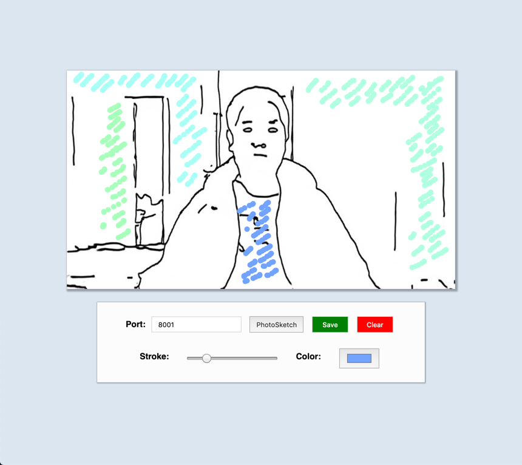

# ColoringBook

Generate contours from images in Runway using **PhotoSketch** and send them to a lightweight coloring app in P5js.

### Running the Example
* Open Runway and create a workspace with the PhotoSketch model. 
* Select HTTP as an output and run the model. Check the [docs](https://docs.runwayapp.ai/#/) for tutorials and additional information.
* Download the example folder and open the HTML file on your preferred browser (or view it using a local web server).
* Make sure the **PORT** input matches Runway's HTTP server route (GET).
* Click on the **PhotoSketch** button to receive the image.
* Have fun coloring and save your art!

